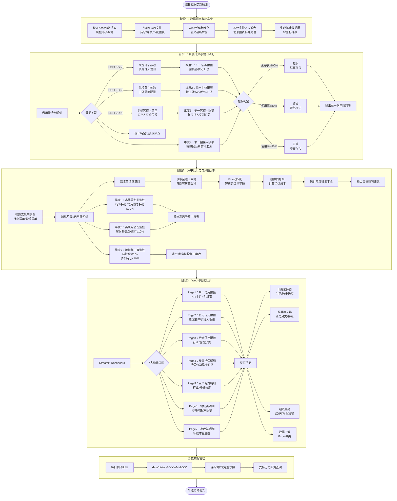

# 投后限额监控业务流程图

以下为 Mermaid 架构图，可在支持 Mermaid 的编辑器、GitHub 或 [Mermaid Live Editor](https://mermaid.live) 中渲染。

```mermaid
flowchart TD
    Start([每日数据更新触发]) --> Stage0

    subgraph Stage0[阶段0：数据提取与标准化]
        A1[读取Access数据库<br/>风控部债券池] --> A2[读取Excel文件<br/>持仓/净资产/配置表]
        A2 --> A3[Wind代码标准化<br/>去交易所后缀]
        A3 --> A4[构建实控人穿透表<br/>北京国资特殊处理]
        A4 --> A5[生成基础数据层<br/>10张标准表]
    end

    Stage0 --> Stage1

    subgraph Stage1[阶段1：限额计算与规则匹配]
        B1[信用债持仓明细] --> B2{数据关联}
        B2 -->|LEFT JOIN| B3[风控部债券池<br/>债券准入规则]
        B2 -->|LEFT JOIN| B4[风控部主体池<br/>主体限额配置]
        B2 -->|LEFT JOIN| B5[调整实控人名单<br/>实控人穿透关系]

        B3 --> C1[维度1：单一债券限额<br/>按债券代码汇总]
        B4 --> C2[维度2：单一主体限额<br/>按主体Wind代码汇总]
        B5 --> C3[维度3：单一实控人限额<br/>按实控人穿透汇总]
        B2 --> C4[维度4：单一担保人限额<br/>按担保公司名称汇总]

        C1 --> D1{超限判定}
        C2 --> D1
        C3 --> D1
        C4 --> D1

        D1 -->|使用率≥100%| D2[超限<br/>红色标记]
        D1 -->|使用率≥80%| D3[警戒<br/>黄色标记]
        D1 -->|使用率<80%| D4[正常<br/>绿色标记]

        D2 --> E1[输出单一信用限额表]
        D3 --> E1
        D4 --> E1

        B2 --> E2[输出特定限额明细表]
    end

    Stage1 --> Stage2

    subgraph Stage2[阶段2：集中度汇总与风险分析]
        F1[读取高风险配置<br/>行业清单/省份清单] --> F2[加载阶段1信用债明细]

        F2 --> G1[维度5：高风险行业监控<br/>行业持仓/信用债总持仓≤10%]
        F2 --> G2[维度6：高风险省份监控<br/>省份持仓/净资产≤10%]
        F2 --> G3[维度7：地域集中度监控<br/>总持仓≤20%<br/>城投持仓≤10%]

        F2 --> H1[高收益债券识别]
        H1 --> H2[读取金融工具池<br/>筛选可转债品种]
        H2 --> H3[ISIN码匹配<br/>穿透表类型字段]
        H3 --> H4[排除白名单<br/>计算全价成本]
        H4 --> H5[统计年度投资本金]

        G1 --> I1[输出高风险集中度表]
        G2 --> I1
        G3 --> I2[输出地域/城投集中度表]
        H5 --> I3[输出高收益明细表]
    end

    Stage2 --> Stage3

    subgraph Stage3[阶段3：Web可视化展示]
        J1[Streamlit Dashboard] --> J2{7大功能页面}

        J2 --> K1[Page1：单一信用限额<br/>KPI卡片+明细表]
        J2 --> K2[Page2：特定信用限额<br/>特定主体/实控人明细]
        J2 --> K3[Page3：分类信用限额<br/>行业/省份分类]
        J2 --> K4[Page4：专业担保明细<br/>担保公司规模汇总]
        J2 --> K5[Page5：高风险类明细<br/>行业/省份预警]
        J2 --> K6[Page6：地域类明细<br/>地域/城投双限额]
        J2 --> K7[Page7：高收益明细<br/>年度本金监控]

        K1 --> L1[交互功能]
        K2 --> L1
        K3 --> L1
        K4 --> L1
        K5 --> L1
        K6 --> L1
        K7 --> L1

        L1 --> M1[日期选择器<br/>当前/历史快照]
        L1 --> M2[数据筛选器<br/>业务分类/评级]
        L1 --> M3[超限高亮<br/>红/黄/橙色预警]
        L1 --> M4[数据下载<br/>Excel导出]
    end

    Stage3 --> Archive

    subgraph Archive[历史数据管理]
        N1[每日自动归档] --> N2[data/history/YYYY-MM-DD/]
        N2 --> N3[保存3阶段完整快照]
        N3 --> N4[支持历史回溯查询]
    end

    Archive --> Report([生成监控报告])
```
